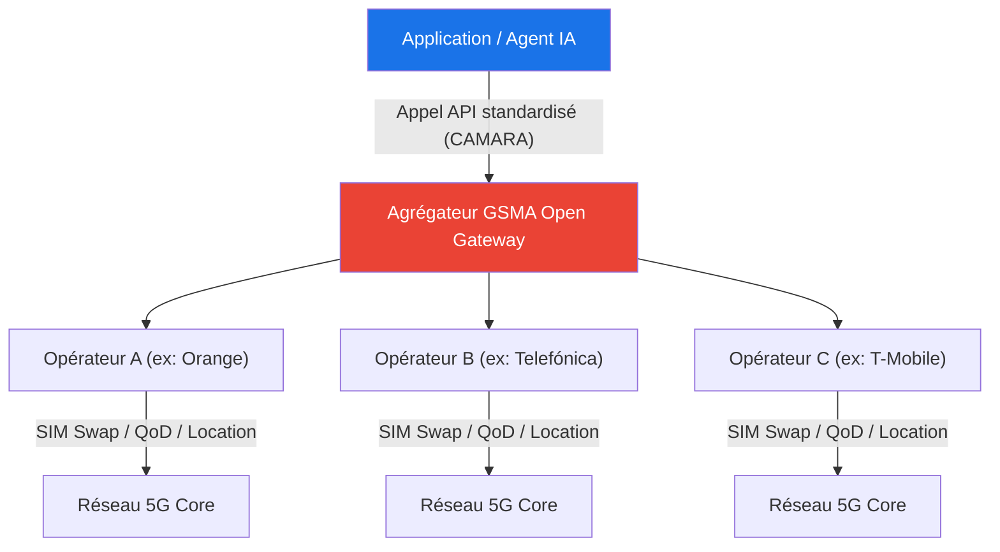
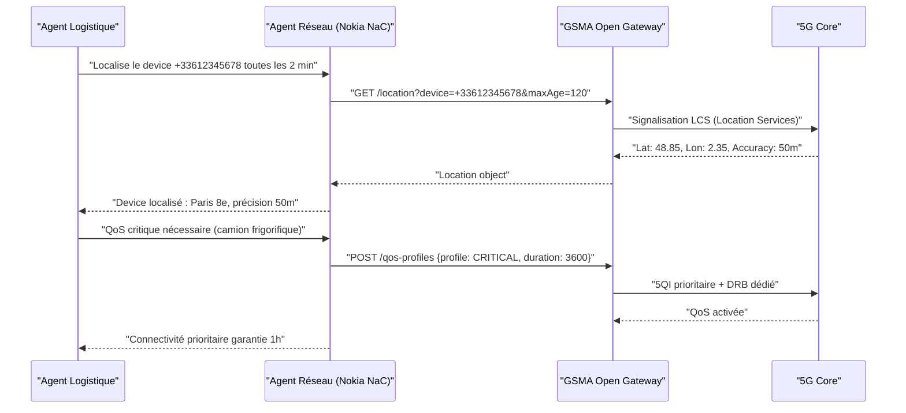

## Du réseau boîte noire au réseau plateforme : le basculement silencieux de MWC 2026

Pendant des décennies, le réseau de télécommunications a fonctionné comme une infrastructure opaque : on le construisait, on le configurait, et les applications se débrouillaient avec ce qu'elles trouvaient. En 2026, ce modèle est officiellement révolu. Au Mobile World Congress de Barcelone, Nokia et Google Cloud ont annoncé l'intégration de la plateforme **Network as Code (NaC)** avec le stack d'IA agentique de Google Cloud — une annonce qui cristallise une transformation profonde : le réseau n'est plus une tuyauterie passive, c'est une plateforme programmable que des agents IA peuvent piloter en temps réel, en langage naturel.

Pour les opérateurs B2B comme Wifirst, qui gèrent des milliers de sites, cette évolution n'est pas anecdotique. Elle ouvre la voie à une nouvelle génération de services — ajustement dynamique de la qualité de service par application, vérification d'identité réseau à l'appel API, localisation précise sans GPS — le tout consommable via une ligne de code ou via un agent autonome. Voici l'état de l'art à l'issue de MWC 2026.

---

## GSMA Open Gateway et CAMARA : la standardisation qui rend tout possible

Pour comprendre l'intégration Nokia/Google Cloud, il faut revenir aux fondations : l'initiative **GSMA Open Gateway**, lancée en 2023, et son pendant technique, le projet open source **CAMARA** (porté par la Linux Foundation).

L'objectif est simple en apparence, complexe à atteindre : créer un catalogue d'APIs standardisées qui fonctionnent de la même façon chez n'importe quel opérateur dans le monde. Un développeur qui appelle l'API `Quality on Demand` chez Orange doit obtenir exactement le même comportement chez T-Mobile, SFR ou Telefónica. C'est l'interopérabilité à l'échelle planétaire.

Trois ans après le lancement, les chiffres donnent le vertige : **plus de 73 groupes d'opérateurs** représentant **284 réseaux mobiles** et **environ 80 % des connexions mondiales** ont rejoint l'initiative. En mars 2026, ce ne sont plus des pilotes ou des annonces de principe — des dizaines de réseaux commerciaux exposent réellement ces APIs à des développeurs.

Le catalogue CAMARA compte aujourd'hui **plus de 25 APIs standardisées** réparties en plusieurs familles fonctionnelles :

| Famille | APIs phares | Cas d'usage |
|---------|-------------|-------------|
| **Authentification & Fraude** | SIM Swap, Number Verification | Lutte contre l'usurpation d'identité bancaire |
| **Localisation** | Device Location, Geofencing | Suivi logistique, conformité réglementaire |
| **Qualité réseau** | Quality on Demand (QoD) | Gaming, chirurgie à distance, visioconférence B2B |
| **Device Info** | Device Status, Reachability | IoT industriel, gestion de flotte |
| **Edge & Compute** | Edge Discovery | Routage vers le serveur de calcul le plus proche |

*Les familles d'APIs CAMARA standardisées, disponibles via GSMA Open Gateway.*

La maturité du standard CAMARA est jugée sur deux critères : la présence dans au moins deux "Meta releases" (versions consolidées du projet), et les implémentations commerciales effectives. Les APIs SIM Swap, Device Location et QoD ont atteint ce niveau de maturité.



*Architecture de l'initiative GSMA Open Gateway : un point d'entrée unique vers des centaines de réseaux opérateurs. L'agrégateur assure la traduction entre l'API normalisée et l'implémentation propriétaire de chaque opérateur.*

---

## Network as Code : le réseau traité comme du logiciel

Le concept de **Network as Code (NaC)** pousse la logique CAMARA encore plus loin. Si CAMARA standardise les APIs, NaC fournit la couche d'abstraction supplémentaire qui transforme ces APIs en ressources consommables par des développeurs — et désormais par des agents IA — sans qu'ils aient besoin de comprendre l'infrastructure sous-jacente.

Nokia, qui a lancé sa plateforme NaC en 2023, connecte aujourd'hui **plus de 70 partenaires** — éditeurs de logiciels, intégrateurs, opérateurs — autour de **plus de 20 APIs réseau**. La plateforme est disponible sur le Google Cloud Marketplace, ce qui simplifie radicalement l'accès pour les équipes développement déjà ancrées dans l'écosystème Google.

Le principe : au lieu d'intégrer un SDK propriétaire par opérateur, un développeur accède à un portail unifié qui expose toutes les fonctions réseau en mode **REST API** ou **SDK Python/JavaScript**. Il écrit :

```python
# Exemple simplifié d'appel Network as Code (SDK Python)
from network_as_code import NetworkAsCodeClient

client = NetworkAsCodeClient(token="...")
device = client.devices.get(phone_number="+33601020304")

# Demander une priorité QoS pour une session vidéo
qos = device.create_qos_profile(
    profile="VIDEO",
    duration=3600  # 1 heure
)
```

Et le réseau — quel que soit l'opérateur qui gère ce device — s'adapte en conséquence. La complexité de la signalisation 5G, du network slicing, et de la coordination entre RAN et Core est totalement masquée.


*Network as Code traduit des appels API de haut niveau en configurations réseau complexes, masquant la signalisation 5G, les protocoles NGAP et les architectures N2/N3 au développeur.*

---

## L'ère agentique : quand l'IA programme le réseau

L'annonce MWC 2026 de Nokia et Google Cloud franchit un nouveau cap. Si NaC rend le réseau programmable par des développeurs humains, l'intégration avec **Gemini** et le stack agentique de Google Cloud le rend programmable par des **agents IA**.

La différence est fondamentale. Un développeur appelle une API avec un intent précis : "allouer 10 Mbps pour cet utilisateur". Un agent IA, lui, part d'un objectif business — "assurer la qualité de la réunion Teams de notre PDG en déplacement" — et détermine de façon autonome quelles APIs appeler, dans quel ordre, avec quels paramètres.

L'architecture repose sur trois couches d'intégration :

**1. La couche d'exposition — Nokia Network as Code**
Cette plateforme abstrait les fonctions complexes du 5G Core et du RAN en APIs Northbound standardisées (CAMARA/GSMA Open Gateway). C'est la fondation stable sans laquelle rien d'autre n'est possible.

**2. La couche d'intelligence — Gemini via MCP**
Le **Model Context Protocol (MCP)** — standard émergent popularisé par Anthropic — permet aux modèles de langage d'exposer et de consommer des "outils". Nokia NaC expose désormais ses APIs comme des outils MCP, permettant à Gemini de les appeler directement pour atteindre des objectifs réseau spécifiés en langage naturel.

**3. La couche d'interaction — Protocole A2A**
Le protocole **Agent-to-Agent (A2A)** permet à des agents métier (ex: un agent logistique, un agent de supervision IT) de déléguer des tâches réseau à un agent spécialisé sans que les deux systèmes aient besoin de partager une plateforme commune. L'agent logistique dit "j'ai besoin de localiser ce device précisément pendant les 30 prochaines minutes" — l'agent réseau traduit en appels CAMARA et exécute.


*Le protocole A2A permet à des agents métier hétérogènes (logistique, finance, IT) de piloter le réseau via un agent réseau spécialisé, sans aucun code d'intégration spécifique.*



*Exemple de dialogue agent-to-agent pour un cas d'usage logistique : localisation et QoS garantie d'un véhicule de transport de valeur, sans une ligne de code spécifique.*

---

## Cas d'usage enterprise : de la théorie à la production

### Finance — Fraude et authentification sans friction

Le secteur bancaire est le premier utilisateur commercial des APIs CAMARA. L'API **SIM Swap** permet de détecter si la carte SIM d'un numéro a été changée dans les dernières heures avant une transaction. Une fraude dite "SIM swapping" — où l'attaquant convainc l'opérateur de transférer le numéro sur une nouvelle SIM — est détectée automatiquement.

Avec l'approche agentique, ce n'est plus le développeur qui code la logique "appeler SIM Swap avant toute transaction > 1000 €". C'est l'agent de scoring de fraude qui, autonomement, décide d'appeler l'API réseau si son modèle identifie un risque. La boucle de décision est entièrement automatisée.

### Logistique — Localisation réseau sans GPS

Dans les entrepôts, ports et zones industrielles, le GPS est souvent inexploitable (signal faible, multitrajets). L'API **Device Location** basée sur les cellules 5G offre une précision de 50 à 200 mètres en environnement dégradé — suffisant pour du géofencing de zones logistiques. Pour des cas plus précis, l'API peut être combinée avec des données Wi-Fi ou BLE.

Un agent logistique peut créer dynamiquement des **geofences** via l'API, être alerté lorsqu'un device entre ou quitte une zone, et adapter la QoS de la connexion selon le contexte (chargement d'un camion frigorifique = profil CRITICAL automatique).

### Industrie 4.0 — Edge Discovery pour le calcul distribué

L'API **Edge Discovery** permet à une application de demander l'adresse IP du serveur de traitement le plus proche géographiquement du device. Couplée à **Google Distributed Cloud (GDC)**, elle permet à un agent de contrôle industriel de router ses inférences IA vers le nœud de calcul avec la latence minimale — typiquement < 10 ms en environnement 5G SA avec edge MEC déployé.


*En entrepôt, l'API Device Location fournit une précision de 50-200m même sans GPS, tandis que QoD garantit la bande passante des terminaux critiques. Un agent logistique orchestre les deux appels de façon autonome.*

---

## Les défis qui restent à résoudre

Malgré l'enthousiasme de MWC, trois obstacles structurels freinent encore le déploiement à grande échelle.

### 1. L'hétérogénéité des implémentations

CAMARA standardise les *interfaces* (le contrat API), mais pas les *backends* (l'implémentation réseau réelle). Une API QoD qui retourne une réponse en 50 ms chez un opérateur peut prendre 500 ms chez un autre selon l'architecture du 5G Core déployé. Pour les cas d'usage à latence critique, cet écart peut être rédhibitoire. L'agrégation via des plateformes comme Shabodi tente de normaliser ces comportements, mais sans garantie de latence uniforme.

### 2. La latence du "round-trip" API

Une reconfiguration réseau via API implique un aller-retour : l'appel REST vers le serveur de l'opérateur, le traitement, la signalisation vers le RAN/Core, et la réponse. En pratique, ce cycle oscille entre **50 et 500 ms** selon les implémentations. Pour des cas d'usage comme les véhicules autonomes ou la chirurgie à distance, ce délai est encore trop élevé. La solution passe par le déploiement d'APIs "on-premise" dans des architectures 5G privées — mais cela réduit le périmètre d'utilisation à des environnements contrôlés.

### 3. La monétisation pour les opérateurs

C'est le nerf de la guerre. Les opérateurs ont investi massivement dans la 5G Standalone — la seule architecture capable de supporter le network slicing et les APIs avancées — et cherchent le retour sur investissement. Trois modèles émergent :
- **Pay-per-use** : facturation à l'appel API (modèle cloud-like, adapté aux développeurs).
- **Subscription tiered** : abonnement mensuel avec quotas d'appels (modèle SaaS).
- **Revenue sharing** : l'opérateur prend un pourcentage de la valeur créée par l'application (modèle platform).

Aucun modèle ne s'est encore imposé. La pression concurrentielle entre opérateurs risque de faire converger les prix vers le bas, rendant difficile l'amortissement des infrastructures NaC.

---

## Ce que ça change pour les opérateurs B2B comme Wifirst

Wifirst opère des milliers de sites Wi-Fi et LAN pour des clients B2B — hôtels, résidences étudiantes, sites industriels, retail. Dans cet univers, plusieurs cas d'usage de Network as Code sont directement actionnables :

- **Ajustement dynamique de la QoS par application** : garantir la bande passante pour les outils de productivité tout en limitant les usages de loisir, sans configuration manuelle par site.
- **Géolocalisation indoor** : en complément du Wi-Fi sensing (IEEE 802.11bf), les APIs de localisation cellulaire enrichissent les données de présence pour les clients retail.
- **Intégration dans des workflows d'IA opérationnels** : un agent de supervision réseau peut appeler directement les APIs pour reconfigurer des politiques QoS lors d'un incident, sans intervention humaine.

La convergence Wi-Fi / APIs GSMA Open Gateway est encore embryonnaire — le standard se concentre sur les réseaux mobiles 5G — mais l'extension aux réseaux Wi-Fi d'entreprise est dans la roadmap CAMARA à horizon 2027-2028.

---

## Conclusion : le réseau liquide

MWC 2026 restera dans l'histoire comme l'édition où le réseau est devenu liquide. Pas dans le sens métaphorique vague, mais dans le sens technique précis : une infrastructure qui s'adapte dynamiquement aux besoins des applications et des agents IA qui les orchestrent, sans friction, sans CLI, sans tickets d'incident.

L'annonce Nokia/Google Cloud n'est pas un prototype de laboratoire. La plateforme NaC est disponible sur le Google Cloud Marketplace, CAMARA compte des dizaines d'APIs matures déployées chez 73+ opérateurs, et GMS + Shabodi fournissent déjà l'agrégation commerciale pour les entreprises qui ne veulent pas négocier bilatéralement avec chaque opérateur.

Le chemin vers le réseau autonome agentique est encore long — les défis de latence, d'hétérogénéité et de monétisation sont réels. Mais la direction est irréversible. Pour les opérateurs B2B, la question n'est plus "faut-il adopter ces APIs ?" mais "à quelle vitesse allons-nous les intégrer dans notre stack pour rester compétitifs ?"

---

**Références :**
- Nokia / Google Cloud, *"From network APIs to network AI agents"*, Nokia Blog, 3 mars 2026
- Nokia, *"Nokia expands Network as Code ecosystem, advances API-based agentic AI with Google Cloud #MWC26"*, GlobeNewswire, 3 mars 2026
- GSMA, *"Happy Anniversary: GSMA Open Gateway Summit at MWC Barcelona 2026"*, 4 mars 2026
- GMS / Shabodi, *"GMS Partners with Shabodi to Accelerate Network APIs Enablement and Aggregation"*, MWC Barcelona, 2 mars 2026
- GSMA, *"Open Gateway API Descriptions — CAMARA Project Overview"*, gsma.com
