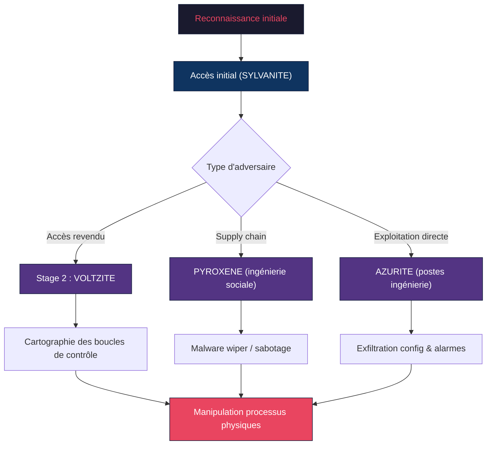
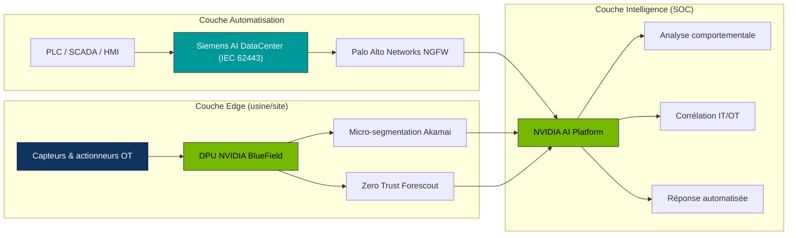

## L'ère de la convergence IT/OT : une surface d'attaque en expansion

Les systèmes de technologie opérationnelle (OT) et les systèmes de contrôle industriel (ICS) n'ont jamais été aussi exposés. Historiquement isolés dans des réseaux air-gapped, ces systèmes pilotent aujourd'hui des processus physiques critiques — production d'énergie, chaînes de fabrication, distribution d'eau, transport — tout en étant de plus en plus connectés aux réseaux d'entreprise et au cloud.

Le 9e rapport annuel de Dragos sur la cybersécurité OT, publié en février 2026, révèle un basculement fondamental : **les adversaires ne se contentent plus de se pré-positionner dans les réseaux industriels — ils cartographient activement les boucles de contrôle et cherchent à manipuler les processus physiques**. Simultanément, NVIDIA annonce des partenariats stratégiques avec Akamai, Forescout, Palo Alto Networks et Siemens pour intégrer l'IA dans la défense OT. Et Forescout documente un pic sans précédent de vulnérabilités haute-sévérité dans les systèmes industriels.

Pour les opérateurs réseau et les DSI, le message est clair : la sécurité OT n'est plus un sujet de niche réservé aux automaticiens. C'est un enjeu réseau, et il est urgent de le traiter comme tel.

## Anatomie des menaces OT en 2026 : le rapport Dragos

Le rapport Dragos 2026 OT Cybersecurity Year in Review constitue la référence annuelle la plus complète sur les menaces ciblant les infrastructures industrielles. Basé sur la télémétrie de la plateforme Dragos, les cas de réponse à incident et la recherche sur les adversaires, ses conclusions sont alarmantes.

### Trois nouveaux groupes de menaces identifiés

Dragos a identifié trois nouveaux groupes ciblant spécifiquement les infrastructures critiques :

- **AZURITE** cible explicitement les postes d'ingénierie (engineering workstations), là où les opérateurs modifient la logique des contrôleurs et interagissent avec les processus physiques. Le groupe exploite rapidement les preuves de concept publiques (PoC) pour profiter du décalage entre la publication du PoC et l'application des correctifs. Il exfiltre des données d'alarmes, des fichiers de configuration et du renseignement opérationnel uniquement utile pour perturber les opérations.

- **PYROXENE** mène des campagnes de supply chain sur plusieurs années via de l'ingénierie sociale ciblant le personnel opérationnel. Faux profils LinkedIn se faisant passer pour des recruteurs, ciblant spécifiquement les personnes travaillant dans les opérations industrielles. En juin 2025, le groupe a déployé un malware wiper personnalisé contre des cibles israéliennes pendant un conflit régional.

- **SYLVANITE** opère comme fournisseur d'accès initial, en weaponisant rapidement les vulnérabilités des équipements edge et en revendant l'accès à des adversaires de Stage 2 comme VOLTZITE. Dragos a directement observé cette passation d'accès, démontrant comment des équipes spécialisées compriment les délais entre compromission et impact.

*Chaîne d'attaque OT en 2026 : de la reconnaissance initiale à la manipulation des processus physiques, selon le rapport Dragos.*

### KAMACITE et ELECTRUM : l'expérience au service de la destruction

Les groupes les plus expérimentés restent KAMACITE et ELECTRUM, responsables des coupures de courant en Ukraine en 2015 et 2016. En 2025, ils ont étendu leurs opérations au-delà de l'Ukraine, vers l'Europe et les États-Unis.

**KAMACITE** a mené une reconnaissance systématique des dispositifs industriels américains entre mars et juillet 2025, cartographiant les boucles de contrôle en ciblant simultanément les interfaces opérateur (HMI), les actionneurs (variateurs de fréquence), les compteurs et les passerelles distantes.

En décembre 2025, **ELECTRUM** a ciblé l'infrastructure énergétique polonaise dans la première attaque coordonnée majeure contre des ressources énergétiques distribuées (éoliennes et installations solaires) à grande échelle.

*Un capteur industriel connecté au réseau : chaque point d'entrée IoT élargit la surface d'attaque OT.*

## Vulnérabilités OT/ICS : les chiffres qui alertent

Les données de Forescout Research (Vedere Labs) dressent un tableau quantitatif préoccupant de l'état des vulnérabilités ICS.

### Un volume de CVE en croissance exponentielle

Entre mars 2010 et janvier 2026, la CISA (Cybersecurity and Infrastructure Security Agency) a publié **3 637 avis ICS couvrant 12 174 vulnérabilités**, affectant 2 783 produits de 689 fournisseurs. L'année 2025 a battu tous les records avec **508 avis couvrant 2 155 CVE** — la première année à dépasser les 500 avis.

| Année | Avis ICS (CISA) | CVE couvertes | CVE/avis moyen |
|-------|----------------|---------------|----------------|
| 2011  | 67             | 103           | 1,5            |
| 2020  | ~300           | ~900          | ~3,0           |
| 2024  | 452            | 1 803         | 4,0            |
| 2025  | 508            | 2 155         | 4,2            |

Le score CVSS moyen des avis tend à augmenter, avec une proportion croissante de vulnérabilités haute-sévérité affectant des composants critiques : contrôleurs de terrain, automates programmables (PLC) et systèmes SCADA.

### Le problème de la visibilité

Forescout souligne un problème structurel : de nombreuses divulgations de vulnérabilités ne sont pas accompagnées d'avis CISA/ICS-CERT correspondants, laissant potentiellement les défenseurs aveugles face à des risques sérieux. C'est le « visibility gap » — l'écart entre les vulnérabilités connues et celles effectivement suivies par les opérateurs.

## NVIDIA et l'IA au service de la cybersécurité industrielle

Face à cette escalade, NVIDIA a annoncé lors de la conférence S4x26 (la référence mondiale en sécurité ICS) un programme de partenariats pour intégrer le calcul accéléré et l'IA dans la cybersécurité OT.

### Architecture de défense distribuée

La vision de NVIDIA repose sur un principe : **la sécurité doit être embarquée dans l'infrastructure, appliquée à l'edge et orchestrée par une intelligence centralisée alimentée par l'IA**. Concrètement, cela se traduit par :

- **Forescout + NVIDIA** : Zero Trust appliqué aux environnements OT. Forescout fournit la découverte continue et agentless des assets OT/IoT/IT avec évaluation du risque en temps réel. Les DPU NVIDIA BlueField exécutent les services de sécurité sur du matériel dédié, séparant la protection des systèmes opérationnels pour ne pas impacter les processus critiques.

- **Siemens + Palo Alto Networks** : Sécurité embarquée dans l'automatisation industrielle. Siemens a présenté son AI-ready Industrial Automation DataCenter, une plateforme unifiée conforme à la norme IEC 62443, intégrant virtualisation, archivage, reprise après sinistre et architecture de cybersécurité robuste.

- **Akamai + NVIDIA** : Micro-segmentation et protection des communications industrielles à l'edge.

- **Xage Security** : Gestion des accès zero-trust pour les environnements distribués.

*Architecture de défense OT multi-couches : l'IA NVIDIA orchestre la sécurité de l'edge au SOC, en passant par l'automatisation industrielle.*

## IEC 62443 : le cadre normatif de la sécurité industrielle

Impossible de parler de sécurité OT sans mentionner la norme IEC 62443 (anciennement ISA/IEC 62443), le standard international de référence pour la cybersécurité des systèmes d'automatisation et de contrôle industriels (IACS).

### Structure de la norme

La norme IEC 62443 est organisée en quatre séries :

- **Série 1 (General)** : concepts fondamentaux, terminologie, modèles de référence
- **Série 2 (Policies & Procedures)** : exigences pour les opérateurs d'assets (propriétaires/exploitants)
- **Série 3 (System)** : exigences au niveau système, incluant les zones et conduits de sécurité
- **Série 4 (Component)** : exigences pour les développeurs de composants et produits

### Zones et conduits : la segmentation industrielle

Le concept central de l'IEC 62443 est la segmentation en **zones** (groupements logiques d'assets partageant le même niveau de sécurité) et **conduits** (canaux de communication contrôlés entre zones). C'est l'équivalent industriel de la micro-segmentation réseau, mais adaptée aux contraintes OT : disponibilité 24/7, protocoles propriétaires (Modbus, Profinet, EtherNet/IP), équipements legacy sans capacité de mise à jour.

### Niveaux de sécurité (SL)

La norme définit quatre niveaux de sécurité (Security Levels) :

- **SL 1** : Protection contre les violations accidentelles
- **SL 2** : Protection contre les attaques intentionnelles avec des ressources limitées
- **SL 3** : Protection contre les attaques sophistiquées avec des ressources significatives
- **SL 4** : Protection contre les attaques étatiques avec des ressources étendues

La plupart des environnements industriels visent SL 2 ou SL 3. L'atteinte du SL 4 reste exceptionnelle et réservée aux infrastructures les plus critiques (nucléaire, défense).

*La connectivité OT s'étend désormais des usines aux smart cities, multipliant les vecteurs d'attaque potentiels.*

## Recommandations pour les opérateurs réseau

Le rapport Dragos et les annonces NVIDIA/Siemens convergent vers un ensemble de recommandations actionables pour les opérateurs d'infrastructure réseau.

### 1. Inventaire et visibilité des assets OT

C'est le prérequis absolu. Impossible de protéger ce qu'on ne voit pas. Les outils de découverte passive (Dragos, Forescout, Claroty, Nozomi Networks) permettent d'inventorier les assets OT sans perturber les opérations. L'objectif : une cartographie complète et à jour de chaque device, protocole et flux de communication dans l'environnement industriel.

### 2. Segmentation réseau IT/OT

La convergence IT/OT ne signifie pas l'absence de frontières. Le modèle Purdue (désormais intégré dans IEC 62443) reste pertinent : séparer les niveaux d'entreprise (IT), de supervision (DMZ), de contrôle (OT) et de terrain (capteurs/actionneurs) avec des contrôles stricts à chaque interface.

Les firewalls nouvelle génération (NGFW) de Palo Alto Networks, déployés avec les DPU NVIDIA BlueField, permettent une inspection protocolaire profonde des flux industriels (Modbus TCP, OPC UA, DNP3) sans impacter la latence.

### 3. Surveillance continue et détection d'anomalies

La détection basée sur les signatures ne suffit plus face à des adversaires qui exploitent des PoC en quelques jours. La détection comportementale — basée sur l'analyse des patterns de communication normaux et l'identification des déviations — devient indispensable. C'est exactement ce que permet l'intégration de l'IA NVIDIA dans les sondes OT.

### 4. Gestion des vulnérabilités adaptée au contexte OT

Le patching en OT n'obéit pas aux mêmes règles qu'en IT. Les fenêtres de maintenance sont rares, les redémarrages coûteux, et certains équipements ne peuvent simplement pas être mis à jour. La stratégie recommandée combine :

- **Priorisation basée sur l'exploitabilité réelle** (pas seulement le score CVSS)
- **Contrôles compensatoires** : segmentation, monitoring renforcé, restriction d'accès
- **Virtual patching** via les NGFW et les IDS/IPS industriels

### 5. Plan de réponse à incident OT spécifique

Un plan de réponse à incident IT ne couvre pas les scénarios OT. Les conséquences d'un incident OT sont physiques : arrêt de production, dommages matériels, risques pour la sécurité des personnes. Un plan dédié doit couvrir :

- L'isolation des zones compromises sans arrêter les processus critiques
- La communication avec les équipes d'exploitation terrain
- Les procédures de bascule en mode manuel
- La coordination avec les autorités (ANSSI en France, CISA aux États-Unis)

## La directive NIS 2 : l'accélérateur réglementaire européen

En Europe, la directive NIS 2 (Network and Information Security), transposée dans les législations nationales depuis octobre 2024, élargit considérablement le périmètre des entités soumises à des obligations de cybersécurité. Les secteurs industriels — énergie, transport, eau, santé, fabrication — sont désormais explicitement couverts.

Pour les opérateurs d'infrastructure réseau desservant ces secteurs, cela signifie :

- **Obligation de notification** des incidents significatifs sous 24h (alerte précoce) puis 72h (rapport complet)
- **Mesures de gestion des risques** incluant la sécurité de la supply chain
- **Responsabilité des dirigeants** en cas de manquement
- **Amendes** pouvant atteindre 10 millions d'euros ou 2% du chiffre d'affaires mondial

## Ce qu'il faut retenir

La sécurité OT/ICS en 2026 se caractérise par trois tendances structurantes :

1. **Des adversaires de plus en plus sophistiqués**, qui passent de la reconnaissance à la manipulation active des processus physiques. Les trois nouveaux groupes identifiés par Dragos (AZURITE, PYROXENE, SYLVANITE) illustrent cette maturation.

2. **Une réponse technologique qui s'organise**, avec l'intégration de l'IA et du calcul accéléré (NVIDIA) dans les architectures de défense industrielles, en partenariat avec les leaders de la cybersécurité (Forescout, Palo Alto Networks) et de l'automatisation (Siemens).

3. **Un cadre réglementaire qui se durcit**, avec NIS 2 en Europe et les exigences croissantes de la CISA aux États-Unis, poussant les organisations à structurer leur approche de la sécurité OT.

Pour les opérateurs réseau B2B, le takeaway est sans ambiguïté : **la sécurité OT est devenue un enjeu réseau**. Les architectures de demain devront intégrer nativement la segmentation IT/OT, la visibilité des assets industriels et la détection comportementale alimentée par l'IA.

---

**Sources et références :**

- [Dragos 2026 OT Cybersecurity Year in Review](https://www.dragos.com/ot-cybersecurity-year-in-review)
- [NVIDIA Brings AI-Powered Cybersecurity to Critical Infrastructure](https://blogs.nvidia.com/blog/ai-cybersecurity-operational-technology-industrial-control-systems/)
- [Forescout — Spike in High-Severity OT/ICS Flaws](https://industrialcyber.co/threats-attacks/forescout-flags-spike-in-high-severity-ot-ics-flaws-exposing-visibility-gaps-that-leave-critical-infrastructure-at-risk/)
- [IEC 62443 — Industrial communication networks – Network and system security](https://webstore.iec.ch/en/publication/33615)
- [Directive NIS 2 — EUR-Lex](https://eur-lex.europa.eu/eli/dir/2022/2555)
