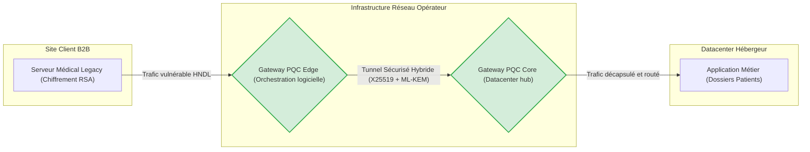

## Introduction : Le changement de paradigme cryptographique dans les réseaux de télécommunications

L'industrie mondiale des télécommunications repose depuis plus de trente ans sur un pacte de confiance mathématique invisible. Chaque transaction financière, chaque échange de données de santé, chaque tunnel privé virtuel (VPN) et chaque session de navigation sécurisée dépendent fondamentalement de la robustesse de la cryptographie à clé publique. Des algorithmes asymétriques tels que le RSA (Rivest-Shamir-Adleman) et la cryptographie sur les courbes elliptiques (ECC) forment la clé de voûte de la sécurité numérique moderne, protégeant l'intégrité et la confidentialité des flux de données à l'échelle planétaire. Or, cette fondation est aujourd'hui mathématiquement condamnée.

L'avènement imminent de l'ordinateur quantique ne représente pas une simple évolution de la puissance de calcul, mais une rupture de paradigme absolue. Contrairement aux ordinateurs classiques qui manipulent des bits binaires, les ordinateurs quantiques exploitent les principes de superposition et d'intrication via des qubits. Cette architecture unique permet d'exécuter l'algorithme de Shor, un modèle théorisé dès 1994, capable de résoudre les problèmes de factorisation de grands nombres premiers et de logarithmes discrets dans un temps polynomial. En d'autres termes, un ordinateur quantique cryptographiquement pertinent (CRQC - *Cryptographically Relevant Quantum Computer*) possédera la capacité de pulvériser les clés RSA et ECC en quelques heures, voire quelques minutes. 

Alors que l'horizon d'un CRQC opérationnel se rapproche inexorablement de la décennie 2030 (une échéance communément appelée le *Q-Day*), l'industrie des télécommunications est confrontée à la plus vaste et la plus complexe migration cryptographique de son histoire. L'année 2026 marque à cet égard une ligne de démarcation nette : le passage définitif d'une phase de recherche et développement théorique à des déploiements tangibles en production, poussés par l'urgence d'une menace asymétrique déjà active sur les réseaux mondiaux.

## La menace "Harvest Now, Decrypt Later" : Une urgence systémique et immédiate

L'un des biais cognitifs les plus dangereux dans l'appréhension du risque quantique consiste à penser que l'absence d'un ordinateur quantique opérationnel aujourd'hui nous octroie un délai de grâce. Cette vision ignore la stratégie sophistiquée baptisée "Harvest Now, Decrypt Later" (HNDL), ou en français, "Collecter aujourd'hui, Déchiffrer plus tard".

Concrètement, des acteurs étatiques disposant de ressources massives, couramment désignés sous le terme de menaces persistantes avancées (APT), ont d'ores et déjà déployé des infrastructures d'interception passive sur les grandes dorsales optiques d'Internet. Leur objectif n'est pas de déchiffrer le trafic en temps réel, une tâche actuellement impossible, mais d'aspirer et de stocker des exaoctets de flux chiffrés. Les handshakes TLS, les échanges de clés IPsec et les tunnels VPN sont minutieusement archivés dans de vastes centres de données gouvernementaux. Ces acteurs hostiles font le pari stratégique que l'avènement d'un CRQC autour de 2030 leur permettra d'appliquer l'algorithme de Shor de manière rétroactive pour révéler les secrets d'aujourd'hui.

La criticité de cette menace se mesure à l'aune du cycle de vie de l'information. Dans les environnements B2B exigeants, de nombreuses données requièrent une confidentialité prolongée. Une propriété intellectuelle sensible, des dossiers médicaux électroniques (DME), des secrets industriels de défense ou des conceptions de réseaux d'Opérateurs d'Importance Vitale (OIV) ont une durée de vie légale et stratégique largement supérieure à cinq ou dix ans. Selon le théorème de Mosca, si la durée de vie requise pour le secret d'une donnée, additionnée au temps nécessaire pour migrer l'infrastructure réseau, dépasse le temps restant avant la création d'un ordinateur quantique, la sécurité de l'organisation est mathématiquement déjà compromise. L'urgence n'est donc pas une projection future, mais un impératif immédiat pour toute donnée dont la confidentialité doit s'étendre au-delà des années 2030.


## Les fondations de l'ère post-quantique : Le triomphe des standards NIST de 2024

Pour contrer l'anéantissement programmé du RSA et de l'ECC, la communauté cryptographique internationale, sous l'égide du National Institute of Standards and Technology (NIST) américain, a initié dès 2016 un vaste concours visant à identifier, éprouver et standardiser de nouveaux algorithmes résistants à l'informatique quantique. L'année 2024 a couronné ce processus exhaustif par la publication finale des premières normes fédérales américaines de traitement de l'information (FIPS) dédiées à la cryptographie post-quantique (PQC).

Le standard FIPS 203 définit le mécanisme d'encapsulation de clés (KEM) principal, baptisé ML-KEM (initialement connu sous le nom de projet CRYSTALS-Kyber). ML-KEM repose sur la complexité mathématique des réseaux euclidiens (*lattice-based cryptography*) et plus spécifiquement sur le problème du "Module-Learning With Errors" (M-LWE). Cette architecture algébrique complexe est intrinsèquement immunisée contre les algorithmes de Shor. ML-KEM est conçu pour remplacer le rôle du Diffie-Hellman dans l'établissement de clés de session partagées.

Pour l'authentification et les signatures numériques, le NIST a officialisé le FIPS 204 (ML-DSA, issu de CRYSTALS-Dilithium), également basé sur les réseaux euclidiens, offrant un excellent compromis entre la taille de la signature et la vitesse de vérification. Cependant, par principe de précaution extrême face au risque théorique de découverte d'une faille dans la théorie des réseaux euclidiens, le NIST a intelligemment standardisé le FIPS 205 (SLH-DSA, ex-SPHINCS+). Ce dernier est un schéma de signature "hash-based" (basé sur le hachage). Bien qu'il génère des signatures nettement plus lourdes, il ne dépend d'aucune hypothèse mathématique complexe autre que la résistance des fonctions de hachage standard (comme SHA-2 ou SHA-3) aux attaques par force brute quantique, offrant ainsi une police d'assurance cryptographique absolue.

Dans le monde des télécommunications, la transition ne se fera pas brutalement. L'industrie a opté pour une approche de déploiement en mode "hybride", qui combine les algorithmes classiques éprouvés avec les nouvelles primitives quantiques. Ainsi, les implémentations modernes du protocole TLS 1.3 adoptent l'identifiant X25519MLKEM768, couplant l'échange de clés sur courbe elliptique (X25519) au standard quantique (ML-KEM). Si l'algorithme quantique venait à présenter une vulnérabilité logicielle de jeunesse, le chiffrement retomberait sur la robustesse du X25519. Cette hybridation prudente est d'ores et déjà en cours d'intégration massive dans les protocoles d'infrastructure tels que IPsec IKEv2 et les tunnels SSH (à l'image d'OpenSSH 9.8+).

```mermaid
sequenceDiagram
    participant C as "Client (Navigateur B2B)"
    participant S as "Serveur (Gateway TLS 1.3)"
    C->>S: "ClientHello (KeyShare: X25519 et ML-KEM-768)"
    S->>C: "ServerHello (Encapsulation ML-KEM et ECC)"
    S->>C: "Certificat Hybride (ML-DSA et RSA)"
    C->>S: "Calcul du Secret Partagé (Fonction HKDF)"
    C<->S: "Trafic Sécurisé Continu (AES-256-GCM)"
```
*Schéma 1 : Mécanisme d'hybridation cryptographique lors d'un handshake TLS 1.3, combinant l'agilité des courbes elliptiques et la résistance quantique des réseaux euclidiens.*

## La convergence technologique : PQC logicielle et QKD matérielle

La sécurisation des réseaux à l'ère quantique s'articule autour de deux grands paradigmes techniques qui, loin de s'opposer, présentent de puissantes synergies fonctionnelles : la cryptographie post-quantique (PQC) et la distribution quantique de clés (QKD).

La PQC, telle que définie par le NIST, est une solution purement mathématique et logicielle. Elle s'exécute sur des processeurs standards (x86, ARM), ne nécessite aucune modification des infrastructures physiques sous-jacentes et offre une scalabilité illimitée à très faible coût. C'est la solution de choix pour sécuriser le trafic de bout en bout sur l'Internet public mondial, des centres de données jusqu'aux terminaux mobiles et à l'IoT de la bordure de réseau (Edge).

À l'inverse, la QKD (*Quantum Key Distribution*) repose sur les lois immuables de la physique quantique, notamment le principe d'incertitude d'Heisenberg et le théorème de non-clonage. La QKD transmet des clés de chiffrement sous forme de photons uniques ou intriqués à travers des fibres optiques dédiées. Toute tentative d'interception par un attaquant modifie inévitablement l'état quantique des photons, trahissant immédiatement la présence de l'intrus. Bien que théoriquement inviolable, la QKD présente des contraintes physiques majeures : elle requiert des équipements très coûteux, nécessite une infrastructure de fibre optique noire dédiée, et sa portée est nativement limitée à environ 100 kilomètres en raison de l'atténuation du signal optique, nécessitant des répéteurs de confiance complexes pour les longues distances.

L'avenir des télécommunications B2B réside dans l'intégration hybride de ces deux technologies. Un cas d'usage emblématique est celui des hôpitaux Vithas à Madrid. Pour protéger les données de santé hypersensibles, l'architecture déploie des liaisons QKD sur la dorsale métropolitaine (Core Network) reliant les centres de données physiques entre eux, garantissant une intégrité physique absolue des clés. En parallèle, les liaisons avec les cliniques distantes et les terminaux médicaux exploitent des tunnels PQC sécurisés par logiciel, offrant une flexibilité géographique totale tout en contrant la menace HNDL.


## MWC 2026 : Le basculement stratégique vers les déploiements réels

Le Mobile World Congress (MWC) de 2026 restera dans les annales comme le point de bascule technologique. Ce qui relevait il y a peu des laboratoires de recherche académique s'est transformé en déploiements commerciaux tangibles et en annonces d'infrastructures à l'échelle des opérateurs de niveau 1 (Tier-1).

L'opérateur Telefónica a notamment bouleversé le marché en dévoilant son framework ambitieux "Quantum Telco". Au cœur de cette architecture se trouve le "Quantum-Safe Cryptographic Hub", une infrastructure matérielle centralisée s'appuyant sur les capacités de chiffrement omniprésent des mainframes IBM LinuxONE. Telefónica a démontré l'importance critique d'un écosystème de partenaires unifié pour sécuriser l'ensemble des couches du modèle OSI. Au niveau de la couche physique et optique, le partenariat avec Adtran permet de chiffrer les interconnexions de centres de données (DCI). Sur la couche réseau de bordure, Fortinet déploie ses appliances Q-Safe Office FortiGate pour protéger les succursales B2B. Enfin, Luxquanta complète l'édifice avec ses solutions QKD à variables continues (CV-QKD) pour les artères de transport optique ultra-sensibles. Comme l'a souligné avec force la direction de Telefónica lors du congrès : *"Le passage au Quantum-Safe n'est plus une option de R&D, mais un impératif de souveraineté numérique."*

Dans la même veine, l'éditeur spécialisé QuSecure a marqué les esprits avec le déploiement opérationnel de sa plateforme QuProtect au sein d'un grand opérateur de télécommunications. Le défi principal des opérateurs réside dans l'hétérogénéité abyssale de leurs réseaux : des millions d'équipements IoT, de routeurs legacy et de serveurs d'application ne disposent ni de la mémoire, ni de la puissance de calcul, ni du support logiciel pour intégrer directement les algorithmes lourds comme ML-KEM. QuSecure répond à ce défi par une approche d'orchestration logicielle centralisée basée sur un modèle de Proxy/Gateway. Les flux non sécurisés ou utilisant du RSA vieillissant sont interceptés par une passerelle de bordure (Edge Gateway) qui encapsule de manière transparente le trafic dans un tunnel quantique résistant, avant de l'acheminer vers le cœur de réseau. Cette approche permet une migration progressive et sans couture, protégeant le transit réseau sans exiger de réécrire des millions de lignes de code d'applications métiers existantes.


*Schéma 2 : Architecture d'encapsulation réseau via le modèle Proxy/Gateway, permettant la sécurisation d'équipements legacy sans modification du code source applicatif.*

## Secteurs sous haute tension et trajectoire réglementaire vers 2030

La transition vers la cryptographie post-quantique n'est pas un exercice technique uniforme ; elle est dictée par la sensibilité des cas d'usage industriels. Quatre secteurs B2B prioritaires sont aujourd'hui en première ligne d'adoption de ces technologies, contraints par la nature de leurs données :
- **La Finance :** La protection des transferts algorithmiques à haute fréquence, des systèmes de compensation interbancaires (SWIFT) et la préservation stricte du secret bancaire mondial.
- **La Défense :** La sécurisation des réseaux C4ISR (Commandement, Contrôle, Communications, Informatique, Renseignement, Surveillance et Reconnaissance) face aux capacités de guerre électronique des États-nations adverses.
- **La Santé :** Le secteur le plus concerné par le cycle de vie de la donnée. Le séquençage génomique, les essais cliniques et les dossiers patients doivent légalement rester confidentiels pendant des décennies.
- **Les OIV et l'Énergie :** La protection des systèmes de contrôle industriel (SCADA) régissant les réseaux électriques intelligents (Smart Grids) contre les cyberattaques disruptives.

La feuille de route industrielle est désormais claire et s'accélère. L'année 2024 a fourni le socle théorique et légal avec les normes du NIST. L'année 2026 est celle des pilotes opérationnels en production et des offres commerciales structurées par les géants des télécoms. La fenêtre 2027-2029 sera marquée par une migration massive à l'échelle européenne, propulsée de manière coercitive par les exigences de la directive européenne NIS2 et du règlement DORA, qui imposent aux entités essentielles le déploiement d'un "état de l'art cryptographique" robuste. Enfin, l'horizon 2030+ marquera la mise au rebut définitive du RSA et de l'ECC, coïncidant avec l'arrivée probabiliste du premier CRQC capable de briser notre monde numérique tel que nous le connaissons.


## Le positionnement stratégique "PQC-Ready" : La proposition de valeur Wifirst

Dans ce paysage technologique en pleine ébullition, le rôle des opérateurs de services managés B2B évolue drastiquement. Un acteur spécialisé dans la connectivité réseau de haute qualité comme Wifirst dispose d'une opportunité stratégique majeure de se positionner en tant que partenaire de confiance "PQC-Ready" pour ses clients d'envergure.

Le passage au Quantum-Safe nécessite avant tout une agilité cryptographique sans faille. Wifirst peut capitaliser sur son expertise de déploiement à grande échelle en proposant des passerelles (gateways) Edge hybrides capables de gérer des tunnels IPsec et SD-WAN nativement chiffrés en X25519+ML-KEM. Cette infrastructure permet de blinder les flux inter-sites des clients avant même que la menace HNDL ne puisse les compromettre sur l'Internet public. 

De plus, la première étape d'une migration PQC réussie consiste à cartographier l'existant. Wifirst se positionne parfaitement pour offrir à ses clients B2B une visibilité cryptographique totale, en générant un "CBOM" (Cryptography Bill of Materials). Cet inventaire dynamique identifie sur le LAN et le WAN les protocoles vieillissants, les clés RSA de faible taille, et les flux en clair, offrant un tableau de bord actionnable pour prioriser la remédiation.

Cette proposition de valeur trouve un écho immédiat et puissant dans les secteurs cibles de Wifirst, notamment la santé clinique et l'hôtellerie de luxe. Les établissements hôteliers très haut de gamme hébergent régulièrement des chefs d'État, des diplomates et des dirigeants de multinationales. La garantie que l'infrastructure Wi-Fi et le LAN de l'établissement sont architecturés pour résister aux attaques d'interception quantique devient un argument de vente B2B différenciant et critique, élevant le niveau de service d'une simple fourniture de bande passante à une véritable prestation de cyber-souveraineté locale.

## Conclusion : Le compte à rebours est enclenché

La transition vers la cryptographie post-quantique constitue le plus grand défi d'ingénierie réseau du XXIe siècle, surpassant de loin la migration vers l'IPv6 ou la dépréciation des protocoles DES et SHA-1. L'illusion que la sécurité des données est une forteresse pérenne a volé en éclats face aux réalités tangibles de l'informatique quantique et des stratégies prédatrices étatiques. Les annonces majeures de l'année 2026 le démontrent sans ambiguïté : la phase d'observation est officiellement terminée. Pour les opérateurs de télécommunications, les fournisseurs de services managés et les directions des systèmes d'information, l'adoption des architectures hybrides, le déploiement de gateways PQC et la quête d'une visibilité cryptographique exhaustive ne sont plus de lointaines perspectives de R&D, mais les fondations impératives de la résilience de demain. Le Q-Day n'est pas une fatalité technologique, mais un compte à rebours industriel que les acteurs les plus agiles ont déjà commencé à maîtriser.