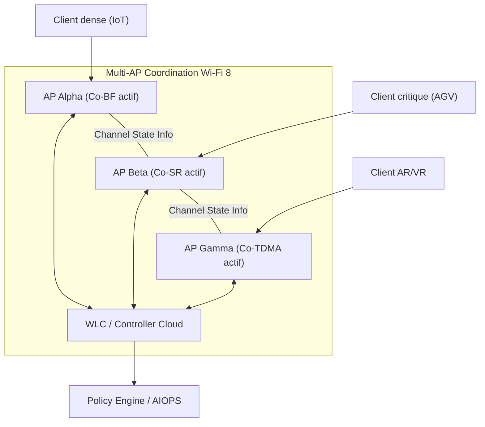
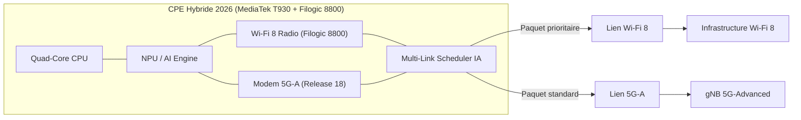

Le Mobile World Congress (MWC) 2026 restera comme un tournant majeur dans l'histoire des réseaux sans fil. Non pas parce qu'une seule technologie a dominé les annonces, mais parce que deux standards — jusqu'ici traités séparément — ont officiellement amorcé leur convergence : le **Wi-Fi 8 (IEEE 802.11bn, dit UHR)** et la **5G-Advanced (3GPP Release 18/19)**. Qualcomm, MediaTek, Fibocom et Quectel ont tous, à Barcelone, présenté des solutions intégrant les deux dans un seul et même chipset ou design de référence.

Pour les opérateurs réseau B2B comme Wifirst, cette convergence n'est pas abstraite. Elle redéfinit l'architecture des CPE (Customer Premises Equipment), l'approche du déploiement en environnements denses et la promesse que nous faisons à nos clients sur la fiabilité de leurs connexions. Cet article décrypte les mécanismes clés de cette révolution, les annonces concrètes du MWC 2026 et ce qu'elles signifient pour l'infrastructure réseau d'entreprise.

## Wi-Fi 8 (UHR) : La fiabilité comme priorité numéro un

C'est une rupture de paradigme dans l'histoire du Wi-Fi. Depuis la norme 802.11b en 1999, chaque génération a cherché à augmenter le débit crête (PHY rate). Le Wi-Fi 6 a introduit l'OFDMA et le MU-MIMO pour améliorer l'efficacité spectrale. Le Wi-Fi 7 a franchi le cap du Multi-Link Operation (MLO), permettant d'agréger plusieurs bandes simultanément. 

Avec le **Wi-Fi 8 (802.11bn)**, aussi baptisé **UHR (Ultra High Reliability)**, l'objectif n'est plus le débit brut — le plafond théorique reste identique au Wi-Fi 7 (environ 46 Gbps) — mais la **fiabilité déterministe** dans des environnements ultra-denses. Comme l'a confirmé CNX Software lors des annonces Qualcomm au MWC 2026 : "il n'apporte pas beaucoup de bénéfices sur Wi-Fi 7 quand on utilise seulement quelques clients, puisque le PHY rate maximum est identique."

C'est précisément là que réside l'intelligence de cette évolution. Dans un entrepôt logistique avec des centaines d'AGV (Automated Guided Vehicles), dans une salle de conférence avec 200 casques AR simultanément actifs, ou dans un hôpital avec des milliers de capteurs IoT — le débit crête ne change rien. Ce qui importe, c'est la **latence garantie, la résilience aux interférences et la capacité à prioriser des flux critiques en temps réel**.

### Multi-AP Coordination : la révolution architecturale

Le cœur de l'innovation Wi-Fi 8 réside dans le **Multi-AP Coordination**, un ensemble de mécanismes qui permettent à plusieurs points d'accès voisins de coordonner leurs transmissions au lieu de se "disputer" le spectre.

Qualcomm, via son annonce FastConnect 8800 et ses plateformes Dragonwing Networking, détaille quatre protocoles de coordination majeurs :

- **Coordinated Beamforming (Co-BF)** : Plusieurs AP collaborent pour former des faisceaux qui s'annulent mutuellement aux points de collision. Un AP peut "supprimer" son signal dans la direction d'un client voisin appartenant à un autre AP, éliminant ainsi l'interférence à la source.
- **Coordinated Spatial Reuse (Co-SR)** : Deux AP proches peuvent transmettre simultanément sur le même canal en ajustant dynamiquement leur puissance d'émission, transformant une situation d'interférence destructrice en coexistence productive.
- **Coordinated TDMA (Co-TDMA)** : Une synchronisation temporelle entre AP pour garantir des fenêtres de transmission dédiées aux flux mission-critical, indépendamment de la charge globale du réseau.
- **Coordinated RTWT (Co-RTWT)** : Extension du Target Wake Time à l'échelle multi-AP, permettant une gestion énergétique coordonnée pour les appareils IoT à contraintes de batterie.

*Architecture Multi-AP en Wi-Fi 8 : les points d'accès partagent en temps réel l'état du canal pour éliminer les interférences par coordination active.*

L'autre nouveauté clé est le **L4S (Low Latency, Low Loss, Scalable throughput)**, directement intégré dans la couche Wi-Fi 8. Ce mécanisme, issu de l'IETF, repense la gestion de la congestion : au lieu de réagir à la perte de paquets (signal tardif), L4S utilise des marqueurs ECN (Explicit Congestion Notification) pour signaler la congestion _avant_ que les files d'attente débordent. Le résultat : une latence de bufferbloat réduite de façon drastique, compatible avec les flux interactifs en temps réel.

### Dynamic Bandwidth Expansion et Single Mobility Domain

Deux autres features méritent l'attention des architectes réseau :

1. **DBE (Dynamic Bandwidth Expansion)** : Contrairement au MLO du Wi-Fi 7, qui agrège des bandes fixes en pré-configuration, le DBE permet d'élargir dynamiquement la fenêtre de transmission sur plusieurs canaux non-contigus, selon les conditions de trafic instantanées.
2. **SMD (Single Mobility Domain)** : Un framework de roaming unifié entre AP hétérogènes (Wi-Fi 7 et Wi-Fi 8 mélangés), avec des transitions invisibles pour l'utilisateur. Sur un déploiement Wifirst à grande échelle — des dizaines de milliers d'AP — c'est une simplification opérationnelle majeure.

## 5G-Advanced (Release 18/19) : L'IA native entre dans le RAN

La **5G-Advanced**, officialisée par la Release 18 de la 3GPP (finalisée fin 2024), marque la première intégration formelle de l'IA et du Machine Learning directement dans les couches radio du réseau. La Release 19, dont Radisys a annoncé une implémentation complète début mars 2026, va encore plus loin en fusionnant les réseaux terrestres (TN) et non-terrestres (NTN, satellites LEO) dans une architecture unifiée.

Le chipset MediaTek T930, présenté au MWC 2026, est la première démonstration silicium de ce qu'implique cette intégration :
- **8 antennes en réception** pour un gain spectral de 40% sur le downlink, grâce à un beamforming adaptatif piloté par IA.
- **3 antennes en émission avec 5 couches MIMO** pour améliorer le throughput uplink de 40%.
- Un **moteur IA L4S intégré** qui, combiné à l'AI QoS, réduit la latence jusqu'à un facteur 10 sur les flux prioritaires — passant de 20ms à moins de 2ms en conditions favorables.

Le principe de l'**AI-RAN** (Artificial Intelligence Radio Access Network) va au-delà de la simple optimisation : il permet au réseau de prédire les variations du canal radio (fading, shadowing, mobility patterns) et d'adapter proactivement les paramètres de transmission, sans attendre la rétroaction des retransmissions HARQ. C'est la différence entre un réseau réactif et un réseau anticipatif.

Radisys a également introduit dans sa Release 19 la gestion native de la **Non-Terrestrial Network (NTN)** : les bases stations peuvent désormais scheduler des slots radio en tenant compte du handover entre cellules terrestres et satellites LEO (comme Starlink ou OneWeb), de manière transparente pour l'application.

## La convergence opérationnelle : le CPE hybride de 2026

Le mariage technique entre Wi-Fi 8 et 5G-Advanced prend forme dans une nouvelle classe d'équipements : les **CPE hybrides intelligents**. Deux annonces majeures au MWC 2026 illustrent cette tendance.

**Quectel + MediaTek** ont présenté un design de référence basé sur le module RG660MK (série Quectel) et la plateforme T930 (MediaTek). Ce CPE intègre un modem 5G-A Release 18, un quad-core CPU, un NPU dédié pour les traitements réseau, et la plateforme Wi-Fi 8 Filogic 8800 — le tout dans un seul boîtier 4nm.

**Fibocom** a dévoilé une solution similaire (FG390 + Filogic 8800), ciblant plus spécifiquement les opérateurs FWA (Fixed Wireless Access) — un marché dans lequel Wifirst opère pour des clients en zones industrielles ou géographiquement complexes.

*Schéma interne du CPE hybride 2026 : un scheduler IA distribue dynamiquement les flux entre les deux technologies selon les conditions radio instantanées.*

Ce scheduler IA est la pièce maîtresse. Il ne fait pas du failover naïf (basculer d'un lien à l'autre en cas de coupure). Il répartit **paquet par paquet** selon un algorithme d'optimisation multi-critères : latence, débit, charge, qualité du signal. Le résultat : une connectivité agréée qui réduit quasi-totalement les micro-coupures et maintient une latence stable même en cas de dégradation partielle d'un des liens.

## Cas d'usage concrets pour les environnements B2B

*Entrepôt logistique 4.0 : des centaines d'AGV et de capteurs IoT maintenus en connexion permanente grâce au Multi-AP Coordination Wi-Fi 8 et à la redondance 5G-Advanced.*

**Logistique et Industrie 4.0** : Un entrepôt de 50 000 m² avec 200 robots mobiles, des convoyeurs automatisés et des systèmes de pick-and-place robotisés. Chaque robot communique en continu avec un WMS (Warehouse Management System) via des messages UDP critiques de moins de 10 octets. Une latence supérieure à 10ms crée des arrêts d'urgence coûteux. Le Wi-Fi 8 UHR gère la densité des robots (Co-TDMA pour les flux critiques) tandis que la 5G-A assure la continuité lors des déplacements rapides entre zones de couverture.

**Santé connectée** : La chirurgie robotique assistée à distance et le monitoring cardiaque en temps réel exigent une latence sub-5ms avec un taux de pertes de paquets inférieur à 10⁻⁶. Ici, la convergence Wi-Fi 8 / 5G-A n'est pas une option de confort — c'est une question de sécurité patient. La double liaison licenciée/non-licenciée crée une redondance physique réelle, sans que le flux de données ne subisse d'interruption perceptible.

**Collaboration AR/VR d'entreprise** : Les casques de nouvelle génération déportent le rendu vers un Edge Cloud local. Pour une expérience XR sans nausée, le RTT (Round-Trip Time) doit rester sous la barre des 20ms. Dans un grand open space avec 50 collaborateurs simultanément en session AR, le Wi-Fi 8 Multi-AP permet de garantir une bande passante par utilisateur sans dégradation liée à la densité.

## Ce que ça change pour Wifirst

Chez Wifirst, nous opérons plus de 15 000 sites avec des contraintes de déploiement variées — hôtellerie, résidentiel collectif, tertiaire, industrie. La convergence Wi-Fi 8 / 5G-A change concrètement trois aspects de notre approche :

1. **Architecture CPE** : Les prochains équipements que nous déploierons n'auront plus à choisir entre Wi-Fi et cellulaire. Un CPE hybride unique couvrira les deux cas d'usage, simplifiant la logistique de déploiement et la gestion du cycle de vie matériel.

2. **SLA (Service Level Agreement)** : Nous pourrons, pour la première fois, proposer des SLA avec des engagements de latence garantis et mesurables, indépendamment des conditions radio locales. C'est un changement fondamental dans la proposition de valeur B2B.

3. **Monitoring et AIOps** : Le Multi-AP Coordination génère un flux massif de métriques temps réel (channel state, interference maps, RSSI coordonnés). Ces données alimentent nos outils d'observabilité (basés sur gNMI et streaming telemetry) et permettent une résolution proactive des incidents, avant même que le client ne les perçoive.

## Conclusion : Vers une connectivité transparente et garantie

La convergence Wi-Fi 8 et 5G-Advanced n'est pas une mode technologique. C'est la réponse structurelle à une demande croissante des entreprises : des réseaux sans fil aussi fiables et prévisibles que des infrastructures filaires, mais avec la flexibilité et l'agilité du sans fil.

Les annonces du MWC 2026 — Qualcomm FastConnect 8800, MediaTek T930 avec Filogic 8800, Radisys Release 19 — ne sont plus des concepts de laboratoire. Ce sont des implémentations silicium, commercialisées d'ici fin 2026, qui vont redessiner le paysage des équipements réseau dans les 18 prochains mois.

Pour les opérateurs réseau qui, comme Wifirst, misent sur la qualité de service comme différenciateur concurrentiel, cette convergence est une opportunité majeure. Celle d'offrir enfin une connectivité véritablement "transparente" — où la technologie porteuse disparaît derrière la promesse d'un service sans faille.
