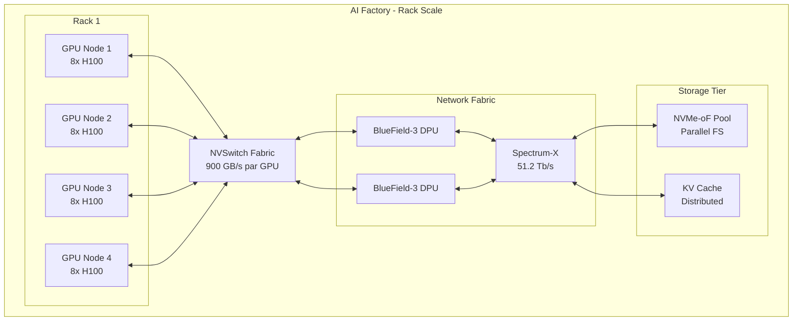
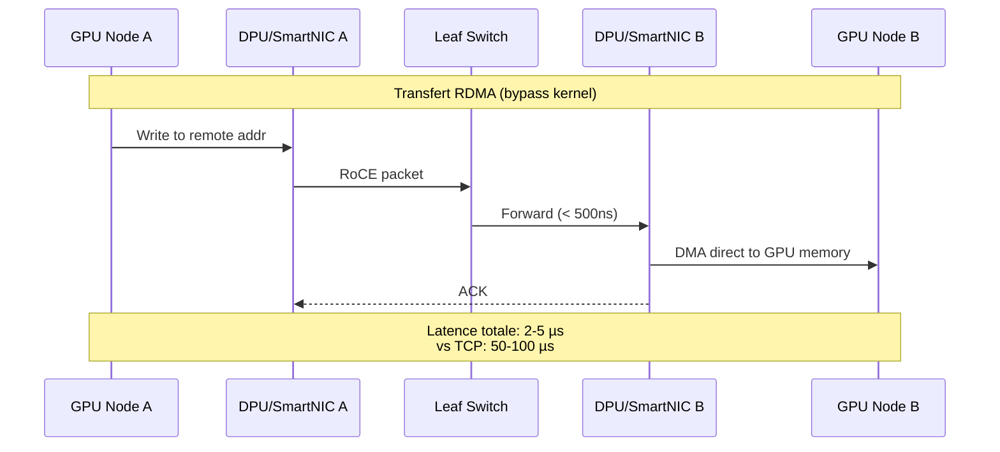
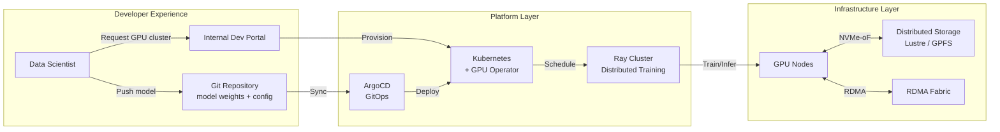

# Infrastructures SI à l'ère de l'IA : quand le réseau devient le nouveau CPU

## L'urgence d'une mutation infrastructurelle

L'explosion des applications IA en entreprise — du copilote de code aux agents autonomes — impose une cadence de déploiement sans précédent. Les cycles traditionnels de mise en production (semaines, mois) sont incompatibles avec un écosystème où un modèle peut être fine-tuné, testé et déployé en quelques heures.

Cette accélération ne concerne pas uniquement le logiciel. Elle exige une refonte complète de l'infrastructure sous-jacente : compute, réseau et stockage doivent évoluer de concert pour absorber des workloads radicalement différents de l'IT classique.

## Du serveur isolé à l'AI Factory

### Le Rack-Scale Design : penser en cluster, pas en machine

L'unité de calcul pertinente n'est plus le serveur individuel mais le **rack entier**. Les architectures modernes (NVIDIA Blackwell, AMD Instinct MI300X) interconnectent des dizaines de GPUs via des bus ultra-rapides (NVLink, Infinity Fabric) pour qu'ils agissent comme un accélérateur unique.

Cette approche permet d'entraîner des modèles de plusieurs centaines de milliards de paramètres sans être limité par la mémoire d'un seul GPU.

### Le défi thermique : du refroidissement air au liquide

Un rack IA moderne consomme entre **40 kW et 120 kW**, contre 5 à 10 kW pour l'IT traditionnel. L'air ne suffit plus à évacuer cette chaleur.

| Type de refroidissement | Capacité max | Use case |
|------------------------|--------------|----------|
| Air traditionnel | ~15 kW/rack | IT legacy, stockage |
| Rear-door Heat Exchanger | ~30 kW/rack | Transition, GPU modérés |
| Direct-to-Chip (DLC) | ~80 kW/rack | Clusters GPU denses |
| Immersion cooling | >100 kW/rack | AI Factories, HPC |

Pour les datacenters existants, le passage au **Direct Liquid Cooling** (DLC) représente un investissement structurel mais devient incontournable dès que la densité GPU augmente.

## Le réseau : nouvelle colonne vertébrale de l'IA

### RDMA et la fin du goulet TCP/IP

Dans une architecture distribuée, les GPUs doivent échanger des gradients et synchroniser leurs états en permanence. Le protocole TCP/IP, conçu pour la fiabilité sur des réseaux hétérogènes, introduit une latence incompatible avec ces workloads.

**RDMA (Remote Direct Memory Access)** permet à un GPU d'écrire directement dans la mémoire d'un autre nœud sans passer par le CPU ni le kernel. Deux implémentations dominent :

- **InfiniBand** : historiquement dominant en HPC, latence ~1 µs
- **RoCE v2 (RDMA over Converged Ethernet)** : standardisation sur Ethernet 400G/800G, latence ~2-3 µs

### DPU : décharger le CPU pour libérer les cycles

Les **Data Processing Units** (BlueField-3/4 chez NVIDIA, IPU chez Intel) embarquent leur propre CPU ARM et accélérateurs réseau. Ils prennent en charge :

- Le chiffrement/déchiffrement TLS
- La virtualisation réseau (vSwitch)
- Le protocole de stockage NVMe-oF
- Le contrôle de congestion adaptatif

Résultat : le CPU hôte reste dédié à l'orchestration et à la préparation des données, pendant que le DPU gère le "data plane".

### Tail Latency : l'ennemi des architectures multi-agents

Pour une requête impliquant 10 agents IA en parallèle, le temps de réponse global est dicté par le plus lent d'entre eux. Cette **latence de queue (P99, P99.9)** devient critique :

- Un seul paquet perdu = retransmission = +50 ms
- Une congestion locale = timeout d'un agent = échec de la chaîne

Les solutions émergentes (NVIDIA Spectrum-X, Broadcom Memory-Aware Congestion Management) implémentent un contrôle de congestion au niveau du switch pour garantir des P99 sous les 10 µs.

## Platform Engineering : le "Paved Road" de l'IA

### De l'Infrastructure-as-Code au Model-as-Code

Le Platform Engineering vise à offrir aux développeurs IA un chemin balisé ("paved road") qui masque la complexité du matériel. L'infrastructure devient un produit interne avec ses propres SLOs.

**Composants clés :**

1. **Internal Developer Portal (IDP)** : Interface self-service pour provisionner un cluster GPU en quelques clics (Backstage, Port)
2. **Kubernetes Operators spécialisés** : Gestion automatique du cycle de vie des modèles (KubeFlow, Ray Operator)
3. **GitOps pour les modèles** : Versionning des weights et configuration dans Git, déploiement automatique via ArgoCD

### CI/CD pour l'IA : au-delà du code

Un pipeline CI/CD IA inclut des étapes absentes du développement logiciel classique :

| Étape | Logiciel classique | Pipeline IA |
|-------|-------------------|-------------|
| Build | Compilation | Conversion de modèle (ONNX, TensorRT) |
| Test | Tests unitaires | Validation de dataset, tests de régression de précision |
| Deploy | Container push | Distribution des weights (plusieurs Go/To) |
| Rollback | Image précédente | Rechargement à chaud des weights |

Le **Blue-Green Deployment** appliqué aux modèles permet de basculer instantanément entre deux versions sans interruption de service.

## Data Gravity : déplacer le calcul, pas la donnée

Les datasets d'entraînement atteignent des tailles (dizaines de To, voire Po) qui rendent leur déplacement impraticable. Le concept de **Data Gravity** impose d'amener le calcul vers la donnée :

- **Hybrid Cloud** : Fine-tuning en local sur données sensibles, inférence dans le cloud public
- **Edge AI** : Modèles compressés déployés au plus près des utilisateurs
- **Federated Learning** : Entraînement distribué sans centralisation des données

Pour l'infrastructure, cela implique une interconnexion fluide entre datacenters privés et clouds publics, avec des solutions de réplication intelligente (AWS DataSync, Azure Data Box).

## Implications pour les opérateurs réseau

Cette transformation crée des opportunités pour les acteurs maîtrisant la connectivité haute performance :

1. **Services réseau AI-Ready** : Offres incluant du RoCE/RDMA managé, garanties de latence P99
2. **Colocation spécialisée** : Espaces équipés pour le liquid cooling et les densités >50 kW/rack
3. **Interconnexion multi-cloud** : Fabric dédié pour le data gravity entre sites

L'infrastructure SI n'est plus un centre de coût passif mais un **accélérateur stratégique** de la capacité d'innovation IA des entreprises.

---

*Article rédigé pour le blog technique Wifirst — Février 2026*
