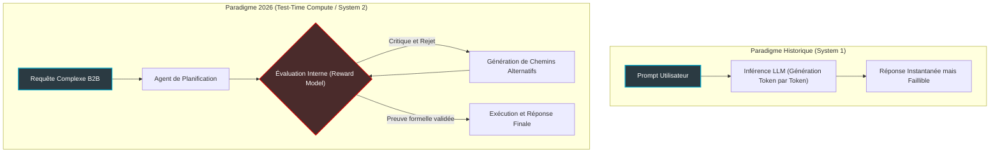
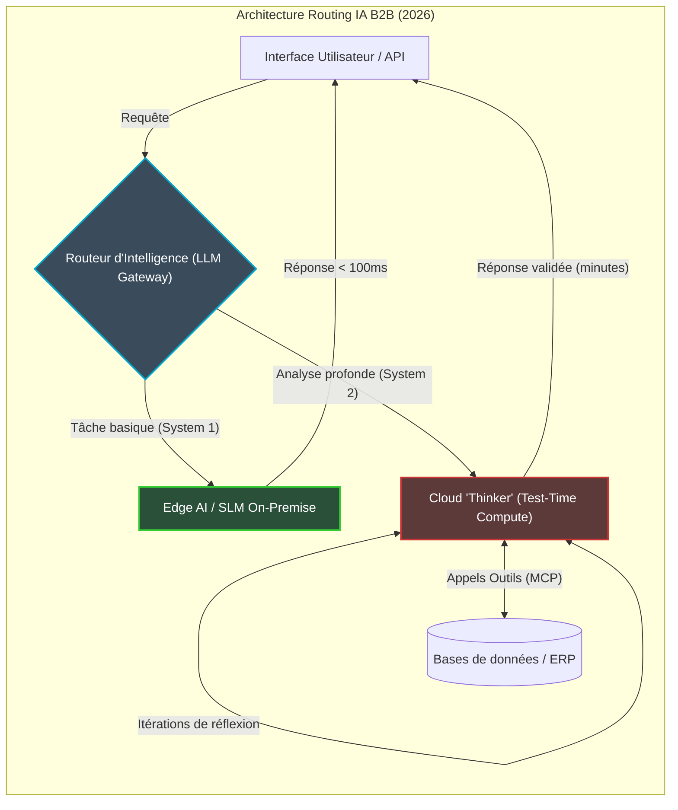

# La fin du paradigme "Scale is All You Need" : Pourquoi l'industrie de l'IA pivote vers le Test-Time Compute et les Laboratoires Autonomes

L'industrie de l'Intelligence Artificielle traverse actuellement une zone de turbulences fondatrices. En ce mois d'avril 2026, une tendance de fond, documentée avec acuité par CNBC, secoue la Silicon Valley : une véritable hémorragie des talents. Des chercheurs de premier plan quittent les rangs d'OpenAI, de Google DeepMind, d'Anthropic et de Meta pour fonder une nouvelle génération de startups. L'exemple de *Periodic Labs*, fondé par des vétérans d'OpenAI et ayant levé 300 millions de dollars quelques mois seulement après son lancement, n'est pas une anomalie. C'est le symptôme d'un basculement tectonique.

La cause de cet exode ? Une prise de conscience scientifique et économique brutale : l'approche consistant à empiler aveuglément des pétaflops de calcul pour le pré-entraînement des LLM (Large Language Models) atteint ses limites physiques, de données et financières. Le paradigme "Scale is All You Need", qui a dominé les cinq dernières années, s'effrite face à ce que l'on appelle désormais "Le Mur de l'Échelle" (The Scaling Wall).

Pour nous, CTOs, architectes systèmes et décideurs technologiques, comprendre cette mutation n'est plus une option. L'ère de la génération textuelle instantanée (System 1) cède la place à celle du raisonnement profond en phase d'inférence (Test-Time Compute ou System 2), et à l'émergence des Laboratoires Autonomes (Autonomous Labs). Voici pourquoi ce basculement redéfinit intégralement l'architecture B2B et l'économie de la donnée.

---

## 1. Le Mur de l'Échelle : Quand le Giga-Datacenter ne suffit plus

Jusqu'en 2024, la recette du succès pour les laboratoires d'IA était d'une simplicité désarmante : prendre plus de données, acheter plus de GPU NVIDIA, augmenter la taille du cluster d'entraînement, et observer l'émergence de nouvelles capacités cognitives (emergent abilities). Mais en 2026, la physique et l'économie ont repris leurs droits.

### L'épuisement du gisement de données humaines
Le premier mur est celui de la donnée. Le web public de haute qualité a été intégralement consommé. Les tentatives de nourrir les modèles avec des données synthétiques (générées par d'autres IA) ont montré leurs limites asymptotiques, conduisant dans certains cas à un phénomène de *Model Collapse* si elles n'étaient pas drastiquement filtrées par des humains. Sans de nouvelles données fondamentales, l'augmentation du nombre de paramètres d'un modèle n'apporte plus qu'un gain marginal.

### Le plafond thermique et énergétique
Le second mur est infrastructurel. Les clusters d'entraînement dépassent aujourd'hui le Gigawatt de consommation électrique. Nous avons atteint un point de friction majeur où les contraintes d'alimentation électrique, le refroidissement liquide à grande échelle et l'opposition politique face à l'empreinte carbone rendent la construction de "Stargate" de 100 milliards de dollars non seulement périlleuse financièrement, mais physiquement complexe à opérer sans pannes matérielles constantes (MTBF des GPU).

Face à ces rendements décroissants, la question s'est posée brutalement : si l'on ne peut plus rendre l'IA fondamentalement plus intelligente en augmentant son temps de lecture (pré-entraînement), comment repousser la frontière ?

---

## 2. Le pivot stratégique vers le "Test-Time Compute" (System 2)

La réponse à cette impasse a provoqué le schisme actuel de l'industrie : le déplacement de la puissance de calcul du pré-entraînement (Pre-training) vers l'inférence (Inference), concept encapsulé sous le nom de **Test-Time Compute**.

Pour vulgariser, imaginez un étudiant passant un examen de mathématiques complexes. L'approche LLM classique (System 1) consiste à exiger de l'étudiant qu'il lise l'énoncé et crache la réponse finale en une fraction de seconde, en se basant sur ses réflexes. C'est impressionnant pour écrire un poème, mais désastreux pour résoudre un théorème inédit.

Le Test-Time Compute (System 2) autorise l'IA à "réfléchir". Le modèle utilise sa puissance de calcul au moment où la question est posée pour générer des dizaines de chemins de réflexion (*Tree of Thoughts*), s'auto-évaluer avec un modèle de récompense (*Reward Model*), corriger ses erreurs, et itérer jusqu'à certitude avant de fournir la réponse finale. Plus on donne de temps de calcul (compute) à l'IA pendant la résolution, plus sa réponse est pertinente, dépassant ainsi les capacités d'un modèle brut beaucoup plus large.

Cette transition a des implications directes : la valeur ne réside plus seulement dans la taille des poids du modèle, mais dans l'algorithme de recherche et d'orchestration exécuté *pendant* l'inférence. Les architectures B2B doivent désormais s'attendre à des requêtes API qui ne durent plus 2 secondes, mais 5 minutes, voire 2 heures pour des tâches d'ingénierie complexes.

---

## 3. L'émergence des Autonomous Labs et la "Science as a Service"

C'est précisément cette capacité de réflexion prolongée qui motive la création de startups comme Periodic Labs. Les chercheurs les plus brillants ont compris que l'étape suivante n'est pas un meilleur "chatbot", mais un agent capable de diriger la méthode scientifique de manière autonome.

Les **Autonomous Labs** (Laboratoires Autonomes) marient les LLM avancés (dotés de Test-Time Compute), la robotique (Embodied AI), et les environnements de simulation massive. Au lieu de demander à une IA "Comment synthétiser tel polymère ?", on lui donne une directive : "Découvre un polymère avec un point de fusion supérieur à 400°C et vérifie-le".

L'agent IA va :
1. Lire toute la littérature scientifique pertinente.
2. Formuler des hypothèses (Test-Time Compute).
3. Piloter des bras robotisés et des séquenceurs dans un laboratoire réel pour synthétiser et tester la matière.
4. Analyser les résultats, mettre à jour ses hypothèses, et recommencer la boucle.

C'est une rupture paradigmatique. L'IA quitte le monde purement digital des bits pour manipuler les atomes. Cela exige des standards d'interopérabilité drastiques entre les modèles IA et les équipements industriels. C'est ici que des standards ouverts comme le **Model Context Protocol (MCP)**, introduit initialement par Anthropic fin 2024 et devenu massivement adopté en 2026, jouent un rôle de bus universel, permettant aux agents de communiquer de manière sécurisée avec n'importe quel instrument ou base de données d'entreprise.

---

## 4. Impact Économique : La redéfinition du rôle du CTO

Pour les décideurs technologiques, la fin de la loi d'échelle et l'avènement du Test-Time Compute bouleversent la feuille de route SI. L'économie de l'IA change de métrique.

### De la facturation au Token à la facturation au Temps de Raisonnement
Jusqu'à récemment, nous optimisions nos prompts pour réduire le nombre de "tokens" en entrée et en sortie. Aujourd'hui, les fournisseurs d'IA (OpenAI, Google Cloud, AWS) commencent à tarifer le "Compute Time". Le CTO doit désormais opérer un arbitrage financier entre un modèle rapide et peu coûteux (System 1) et un modèle lent, cher, mais garantissant l'absence d'hallucinations mathématiques (System 2).

### L'Architecture Hybride "Edge-to-Cloud" Agentique
Il est économiquement suicidaire d'utiliser un modèle System 2 pour extraire le nom d'un client d'un email. En 2026, l'architecture de référence devient l'hybridation intelligente.

Les terminaux (PC, routeurs, smartphones) équipés de NPU puissants exécutent des SLM (Small Language Models) locaux qui gèrent 80% du flux transactionnel instantané (System 1), préservant la souveraineté des données et annulant la latence. Seules les requêtes nécessitant une planification complexe (refactoring de code, analyse financière, cybersécurité prédictive) sont routées vers les "Thinkers" hébergés dans le Cloud B2B.

### La primauté des données propriétaires et des outils
Puisque le pré-entraînement généraliste a atteint un plateau pour tous les acteurs majeurs, la différenciation d'une entreprise ne viendra plus du modèle de fondation qu'elle utilise, mais de la qualité des outils (API internes, bases de connaissances RAG structurées) qu'elle expose à ses agents via le protocole MCP. L'intégration sécurisée de ces agents dans le réseau d'entreprise (Zero Trust, ZTNA) devient le chantier prioritaire des DSI.

---

## Conclusion : S'adapter à l'ère de l'Agentivité

Le ralentissement apparent des lois d'échelle n'est pas un échec de l'industrie de l'IA ; c'est sa phase de maturité. En déplaçant l'effort de calcul du laboratoire de R&D (Pre-training) vers l'environnement de production (Test-Time Compute), et en donnant aux agents les moyens d'agir sur le monde réel (Autonomous Labs), la technologie franchit le gouffre qui séparait le simple outil de productivité du véritable collaborateur autonome.

Pour les entreprises, le défi n'est plus d'intégrer un chatbot dans un intranet, mais d'orchestrer une force de travail hybride où des agents d'intelligence artificielle, dotés d'un raisonnement de System 2, résoudront des problèmes d'ingénierie, de logistique et de recherche de manière totalement asynchrone. L'ère du "Scale is All You Need" est morte. Vive l'ère du "Reasoning at Scale".

## 5. La matrice matérielle : Le crépuscule du GPU monolithique et l'avènement du NPU

Si la dimension logicielle de l'IA mute vers le Test-Time Compute, l'infrastructure matérielle sous-jacente subit une transformation tout aussi radicale. Le règne absolu du GPU monolithique, pensé pour le traitement parallèle massif (idéal pour le pré-entraînement et le System 1), montre ses premières faiblesses face aux exigences de l'inférence raisonnée. 

Le Test-Time Compute exige des sauts de mémoire (memory leaps) rapides et asynchrones pour évaluer de multiples chemins de pensée. Cette dynamique de recherche arborescente sature la bande passante mémoire (HBM) bien plus vite qu'elle n'exploite la puissance de calcul pur (les TFLOPS). Par conséquent, nous voyons émerger en 2026 une nouvelle génération de puces hybrides : les LPU (Language Processing Units) et les NPU (Neural Processing Units) avancés, spécialement taillés pour l'inférence. Ces architectures privilégient une mémoire ultra-rapide et distribuée au plus près des cœurs de calcul, réduisant considérablement la latence lors de la génération de centaines de tokens alternatifs pour le Reward Model.

L'impact sur l'infrastructure B2B est immédiat. Au lieu d'investir massivement dans des serveurs cloud équipés de cartes hors de prix pour l'entraînement, les DSI réorientent leurs budgets d'infrastructure (CapEx) vers des flottes de serveurs d'inférence spécialisés. L'objectif est d'atteindre le meilleur ratio TCO (Total Cost of Ownership) par itération de raisonnement. L'arrivée des puces ARM intégrant nativement des NPU ultra-efficients permet de rapatrier une partie de ce calcul de System 2 directement "On-Premise", sécurisant par la même occasion le traitement des données sensibles de l'entreprise. L'infrastructure réseau, quant à elle, doit s'adapter pour garantir des flux de données ininterrompus et sécurisés (via des protocoles comme RoCE et des architectures ZTNA) entre l'Edge, où réside l'agent de routage, et le Cloud, où résident les fermes de "Thinkers".

## 6. L'EU AI Act comme catalyseur : Conformité et Gouvernance des Agents Autonomes

Il serait naïf de penser que cette mutation technologique s'opère en vase clos, déconnectée des réalités géopolitiques et réglementaires. L'entrée en vigueur pleine et entière de l'EU AI Act en cette année 2026 joue, contre toute attente, un rôle d'accélérateur pour le Test-Time Compute et les Laboratoires Autonomes dans le domaine B2B.

L'une des exigences fondamentales de l'AI Act pour les systèmes d'IA dits "à haut risque" (High-Risk AI Systems) réside dans la transparence, l'explicabilité et l'auditabilité des décisions. Or, le paradigme historique (System 1) fonctionnait comme une boîte noire : une entrée, un calcul statistique de milliards de paramètres, et une sortie instantanée. Tenter d'expliquer "pourquoi" un LLM classique a recommandé telle ou telle action relevait de la rétro-ingénierie hasardeuse.

Le Test-Time Compute (System 2) résout élégamment ce problème par son architecture même. Puisque le modèle génère explicitement un arbre de pensée (*Tree of Thoughts*), évalue les conséquences, et critique ses propres hypothèses avant de répondre, l'intégralité de cette "chaîne de raisonnement" peut être capturée, loguée et auditée. Pour la première fois, l'agent IA produit son propre registre de conformité en temps réel. Si une décision algorithmique (par exemple, dans le recrutement, l'octroi de crédit, ou l'automatisation d'infrastructure critique) est contestée, le DSI peut littéralement extraire l'étape exacte de l'arbre de décision et fournir aux auditeurs de l'UE la justification probabiliste utilisée par le modèle.

De plus, l'obligation européenne de mettre en place une gouvernance des risques (Risk Management System) pousse les entreprises à isoler et encapsuler leurs processus d'IA. C'est ici que l'approche des Laboratoires Autonomes brille : en orchestrant des flux de travail agentiques (Agentic Workflows) encadrés par le Model Context Protocol (MCP), l'entreprise peut définir des limites d'action strictes (guardrails). Le modèle est libre d'explorer et de raisonner, mais ses actions concrètes via API sont validées cryptographiquement et humainement si nécessaire. L'EU AI Act n'a pas tué l'innovation ; il a forcé la transition vers une IA d'entreprise mature, transparente et fondamentalement architecturée pour le "Reasoning at Scale".
